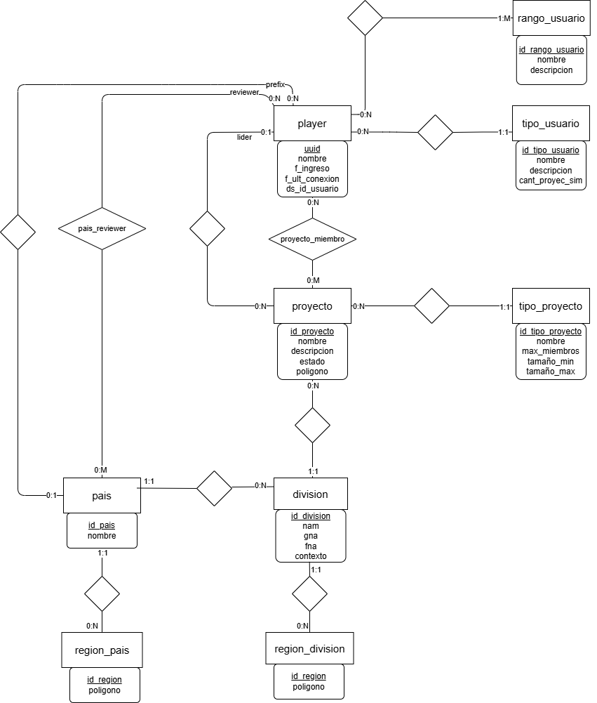

# BTE Cono Sur - Panel Web

## Integrantes

| Legajo | Apellido y Nombres |
|--------|---------------------|
| 51419  | Marquez, Matías     |

## Enunciado General

El sistema a desarrollar es una aplicación web cliente-servidor en Java destinada a la
gestión de jugadores y proyectos dentro del servidor BTE Cono Sur. Build The Earth (BTE)
es un proyecto global y colaborativo que busca recrear el planeta Tierra en Minecraft en
escala 1:1. El servidor BTE Cono Sur agrupa a los equipos de Argentina, Chile, Perú,
Bolivia, Paraguay y Uruguay.

La aplicación web permite administrar jugadores, proyectos, países, divisiones y sus
regiones poligonales, actuando como interfaz gráfica para las operaciones que el plugin
**bteCSCore** (sistema central del servidor de Minecraft) expone a través de su API REST
(Javalin). Toda la lógica de negocio y la persistencia de datos son gestionadas por dicho
plugin; el sistema web se limita a presentar la información y delegar las operaciones
mediante llamadas HTTP. El acceso se realiza mediante OAuth2 de Discord, y el sistema
cuenta con tres niveles de acceso: Jugador, Reviewer y Admin.

## Modelo de Dominio



## Arquitectura

```
[ Browser ]
      |
[ Servlets + JSP (Apache Tomcat 11) ]
      |  HTTP (REST, JSON)
[ Plugin bteCSCore - API Javalin (Servidor de Minecraft) ]
      |
[ Base de Datos ]
```

- **Capa de presentación**: JSP con scriptlets, HTML5/CSS3, Bootstrap 5.
- **Capa de control**: Servlets Jakarta EE en Apache Tomcat 11.
- **Capa de lógica / acceso a datos**: los Servlets se comunican vía HTTP con la API REST
  del plugin bteCSCore (Javalin), que gestiona la base de datos y la caché en memoria del
  servidor de Minecraft.
- **Mapas interactivos**: Leaflet + Leaflet.draw para visualización y edición de polígonos
  geográficos (proyectos, regiones de país y de división).

## Casos de Uso / User Stories — Regularidad

| Requerimiento | Caso de Uso |
|---|---|
| ABMC simple | Tipo de Usuario |
| ABMC simple | Tipo de Proyecto |
| ABMC dependiente | Rango de Usuario |
| ABMC dependiente | División (depende de País) |
| CU NO-ABMC | Solicitud de Unión a Proyecto |
| Listado complejo | Listado de Proyectos con filtro por ID |

## Casos de Uso / User Stories — Aprobación Directa

| Requerimiento | Caso de Uso |
|---|---|
| ABMC completo | Tipo de Usuario |
| ABMC completo | Rango de Usuario |
| ABMC completo | Tipo de Proyecto |
| ABMC completo | País (+ Regiones de País) |
| ABMC completo | División (+ Regiones de División) |
| BMC completo | Proyecto (alta desde el juego) |
| BMC | Player (alta desde el juego) |
| CU Complejo (resumen) | Revisión de Proyecto - Evento 1: Marcar como finalizado (Líder) / Evento 2: Aprobar o Rechazar finalización (Reviewer) |
| Listado complejo | Listado de Proyectos, filtro por ID |
| Listado complejo | Listado de Jugadores, filtro por nombre |
| Niveles de acceso | Jugador / Reviewer / Admin / Líder |
| Publicación |  |

### Requerimiento Extra — Aprobación Directa

| Requerimiento | Detalle |
|---|---|
| Manejo de archivos / mapas interactivos | Edición y visualización de polígonos geográficos sobre mapa (Leaflet) para Región de País y Región de División. |

## Tecnologías

- Java 17, Apache Tomcat 11
- JSP (scriptlets), Bootstrap 5.3, Leaflet + Leaflet.draw
- Javalin (API REST del plugin bteCSCore), Gson, JTS (GeoJSON / geometría)
- OAuth2 (Discord) para autenticación
- Maven